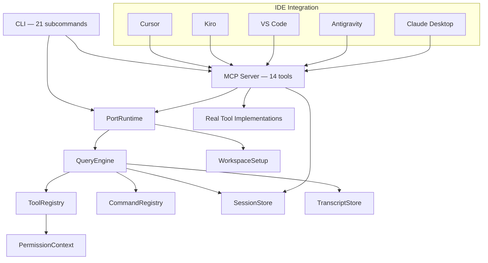

<p align="center">
  
</p>

<p align="center">
  
  
  
  
  
  
  
  
</p>

<h1 align="center">gocode — Claude Code, Rewritten in Go</h1>

<h3 align="center">The Go version of Claude Code. One binary. Zero dependencies. 20× faster.</h3>

<p align="center">
  <strong>An open-source Go reimplementation of the Claude Code AI coding agent.</strong><br/>
  We took the Claude Code architecture — the AI agent runtime that powers tool orchestration, session management, and prompt routing — and rebuilt every subsystem in Go. The result: a single compiled binary under 12MB, with <code>&lt;10ms</code> startup, full MCP protocol compliance, and native integration with Cursor, Kiro, VS Code, Antigravity, and Claude Desktop. No Python. No Node. No dependencies. Just Go.
</p>

<p align="center">
  <code>go install github.com/AlleyBo55/gocode/cmd/gocode@latest</code>
</p>

---

## Why gocode Exists

Every great product starts with a simple observation.

Claude Code is a remarkable piece of engineering. The way it decomposes tool orchestration. The way it manages sessions. The way it routes prompts. The architecture is elegant. The ideas are right.

But the implementation carries weight it doesn't need. Python runtime. Package managers. Virtual environments. Hundreds of milliseconds just to start. An entire ecosystem of dependencies before you can write a single line of code.

We looked at that and asked a simple question: **what if the best AI coding agent was also the fastest?**

Not a wrapper around the original. Not a thin binding. A complete, ground-up reimplementation in Go — every registry, every scoring algorithm, every subsystem — enhanced with a production-grade MCP server and native IDE integrations that the original never had.

gocode starts in under 10 milliseconds. It ships as a single 12MB binary. It runs on any machine with zero setup. You download it. You run it. That's the entire installation process.

> *We believe the tools developers use every day should be instant. Not fast. Instant. The moment between your thought and your tool's response should be imperceptible. That's what gocode delivers.*

---

## What Is gocode?

**gocode is the Go version of Claude Code** — a complete, open-source reimplementation of the Claude Code AI agent harness runtime, written from scratch in Go.

If you've used [Claude Code](https://docs.anthropic.com/en/docs/claude-code), you know what it does: it's the engine that sits between you and AI. It routes your prompts to the right tools. It manages sessions across conversations. It tracks token budgets. It orchestrates everything the AI coding assistant needs to function.

We ported all of that to Go. Then we made it better.

### What Makes gocode Different

| What You Get | Why It Matters |
|---|---|
| **Single binary, zero dependencies** | Download one file. Run it. On any machine. Done. |
| **<10ms cold start** | 20× faster than the Python original. Your tools should never make you wait. |
| **Full MCP server built in** | Connect Cursor, Kiro, VS Code, Claude Desktop, or any MCP client instantly. |
| **14 real, working tools** | Not stubs. Real shell execution, file I/O, grep, glob, prompt routing, workspace analysis. |
| **Native IDE integration** | Drop-in configs for Cursor, Kiro, VS Code, Antigravity, and Claude Desktop. |
| **MIT licensed, fully open source** | Read every line. Fork it. Extend it. Make it yours. |

---

## The Numbers

| Metric | Claude Code (Python) | gocode (Go) |
|--------|---------------------|-------------|
| Startup time | ~200ms | **<10ms** (20× faster) |
| Binary size | N/A (interpreted) | **~12MB** (single file) |
| Runtime dependencies | Python 3.10+, pip, venv | **None** |
| Deployment | `pip install` + virtualenv | **Copy one file** |
| Concurrency model | asyncio / threading | **Goroutines + channels** |
| Type safety | Runtime (mypy optional) | **Compile-time guarantees** |
| MCP compliance | N/A | **Full specification** |
| IDE integrations | N/A | **5 IDEs supported** |

---

## Features

### Core Runtime — Ported from Claude Code
- 🚀 **<10ms startup** — compiled Go binary, not interpreted Python
- 🧠 **Intelligent prompt routing** — tokenize prompts, score against registered tools and commands
- 💾 **Atomic session persistence** — temp-file + rename pattern, zero corruption risk
- 📊 **Token budget enforcement** — turn limits, token budgets, auto-compaction
- 📡 **Streaming output** — real-time results via Go channels
- 🔐 **Permission system** — deny-lists, prefix matching, fine-grained tool access control

### MCP Server — Enhanced Beyond the Original
- 🔌 **Full MCP protocol** — `initialize`, `tools/list`, `tools/call`, `ping`, `resources/list`
- 🛠 **14 production tools** — shell execution, file I/O, grep, glob, prompt routing, workspace scanning
- 📋 **JSON Schema definitions** — every tool has `inputSchema` with typed properties and descriptions
- 🌐 **Dual transport** — stdio for IDE integration, HTTP for any client

### IDE Integration — Not in Claude Code
- 💻 **Cursor** — `.cursor/mcp.json` drop-in config
- ⚡ **Kiro** — native hooks, steering files, spec-driven development workflows
- 🔵 **VS Code** — `.vscode/mcp.json` for Copilot Chat, Continue, and MCP extensions
- 🟣 **Antigravity** — `.gemini/settings/mcp.json`
- 🟡 **Claude Desktop** — `claude_desktop_config.json`

### Engineering Quality
- 📦 **Single binary** — `go build` → one file, runs everywhere
- 🏗 **22 internal packages** — clean, interface-driven architecture
- 🧪 **Full test suite** — MCP protocol tests, all passing
- 🌍 **Cross-platform** — Linux, macOS, Windows × amd64, arm64

---

## Quickstart

### Install

```bash
# Any OS with Go 1.21+
go install github.com/AlleyBo55/gocode/cmd/gocode@latest

# macOS (Homebrew)
brew install AlleyBo55/gocode/gocode

# One-line install script
curl -fsSL https://raw.githubusercontent.com/AlleyBo55/gocode/master/install.sh | bash

# Linux (.deb)
curl -Lo gocode.deb https://github.com/AlleyBo55/gocode/releases/latest/download/gocode_amd64.deb
sudo dpkg -i gocode.deb

# Linux (.rpm)
curl -Lo gocode.rpm https://github.com/AlleyBo55/gocode/releases/latest/download/gocode_amd64.rpm
sudo rpm -i gocode.rpm

# Windows (Chocolatey)
choco install gocode
```

### Try It

```bash
# Route a prompt to the best tools and commands
gocode route "read the file and run tests"

# Bootstrap a full agent session
gocode bootstrap "help me refactor the auth module"

# Run a multi-turn agent loop
gocode turn-loop "find all TODO comments and fix them" --max-turns 5

# Start as an MCP server for your IDE
gocode mcp-serve --transport stdio

# Start as an HTTP MCP server
gocode mcp-serve --transport http --addr :8080
```

---

## MCP Server — Connect Any AI IDE

gocode speaks [Model Context Protocol](https://modelcontextprotocol.io/) natively. Every major AI coding assistant can connect to it over stdio or HTTP.

### 14 MCP Tools


#### Standard File-System Tools
| Tool | Description |
|------|-------------|
| `BashTool` | Execute shell commands with timeout and exit code capture |
| `FileReadTool` | Read files with optional line range selection |
| `FileEditTool` | Edit files via exact search and replace |
| `FileWriteTool` | Create or overwrite files with auto-mkdir |
| `GlobTool` | Find files matching glob patterns |
| `GrepTool` | Recursive content search with include filters |
| `ListDirectoryTool` | List directories with file sizes |

#### gocode-Exclusive Orchestration Tools
| Tool | Description | Why It's Unique |
|------|-------------|----------------|
| `gocode_route` | Route prompts to best-matching tools via token scoring | No other MCP server does prompt-to-tool routing |
| `gocode_bootstrap` | Initialize a full agent session with workspace analysis | Instant project context for any AI |
| `gocode_workspace_scan` | Deep structural analysis of your codebase | Module map, file counts, architecture overview |
| `gocode_session_save` | Persist session state atomically to disk | Cross-conversation memory |
| `gocode_session_load` | Restore saved sessions | Resume where you left off |
| `gocode_list_commands` | Discover all registered commands | Self-describing command system |
| `gocode_manifest` | Generate full project health manifest | Module status dashboard |

### Connect Your IDE

#### Cursor

Add to `.cursor/mcp.json`:

```json
{
  "mcpServers": {
    "gocode": {
      "command": "gocode",
      "args": ["mcp-serve", "--transport", "stdio"]
    }
  }
}
```

#### Kiro

Add to `~/.kiro/settings/mcp.json` or `.kiro/settings/mcp.json`:

```json
{
  "mcpServers": {
    "gocode": {
      "command": "gocode",
      "args": ["mcp-serve", "--transport", "stdio"],
      "disabled": false,
      "autoApprove": ["tools/list"]
    }
  }
}
```

#### VS Code (Copilot Chat / Continue)

Add to `.vscode/mcp.json`:

```json
{
  "servers": {
    "gocode": {
      "type": "stdio",
      "command": "gocode",
      "args": ["mcp-serve", "--transport", "stdio"]
    }
  }
}
```

#### Antigravity

Add to `.gemini/settings/mcp.json`:

```json
{
  "mcpServers": {
    "gocode": {
      "command": "gocode",
      "args": ["mcp-serve", "--transport", "stdio"],
      "disabled": false
    }
  }
}
```

#### Claude Desktop

Add to `~/Library/Application Support/Claude/claude_desktop_config.json` (macOS) or `%APPDATA%\Claude\claude_desktop_config.json` (Windows):

```json
{
  "mcpServers": {
    "gocode": {
      "command": "gocode",
      "args": ["mcp-serve", "--transport", "stdio"]
    }
  }
}
```

#### Any HTTP Client

```bash
gocode mcp-serve --transport http --addr :8080
# → POST http://localhost:8080/mcp
```

---

## Architecture

A complete Go reimplementation of the Claude Code agent harness — 22 internal packages, clean interfaces, zero external runtime dependencies.

```
gocode/
├── cmd/gocode/main.go          # CLI entrypoint — 21 subcommands, one binary
├── data/
│   ├── commands.json            # Embedded command registry (go:embed)
│   ├── tools.json               # Embedded tool definitions with JSON Schema
│   └── data.go                  # go:embed directives
├── internal/
│   ├── models/                  # Core types: ToolDefinition, InputSchema, UsageSummary
│   ├── permissions/             # Tool access control (deny-names, deny-prefixes)
│   ├── context/                 # Workspace scanning and file discovery
│   ├── commands/                # Command registry — load, search, filter, execute
│   ├── tools/                   # Tool registry — MCP-compliant definitions + filtering
│   ├── toolimpl/                # Real tool implementations (BashTool, FileReadTool, etc.)
│   ├── toolpool/                # Assembled tool pool with chained filters
│   ├── execution/               # Unified dispatch — MirroredCommand + MirroredTool
│   ├── queryengine/             # Core engine — turns, budgets, streaming, compaction
│   ├── session/                 # Session persistence (atomic JSON writes)
│   ├── history/                 # Session event timeline
│   ├── transcript/              # Conversation transcript management
│   ├── runtime/                 # Top-level orchestrator — routing + bootstrap
│   ├── setup/                   # Environment detection + concurrent prefetches
│   ├── deferred/                # Post-bootstrap initialization
│   ├── systeminit/              # System init message builder
│   ├── bootstrap/               # Bootstrap stage dependency graph
│   ├── commandgraph/            # Command segmentation (builtin/plugin/skill)
│   ├── manifest/                # Source directory scanner
│   ├── modes/                   # Connection modes (direct, remote, SSH, teleport)
│   ├── mcp/                     # MCP server — full protocol, stdio + HTTP
│   └── kiro/                    # Kiro integration (hooks, steering, specs)
```

### System Overview



---

## MCP Protocol Compliance

gocode implements the complete MCP specification:

| Feature | Status |
|---------|--------|
| `initialize` / `notifications/initialized` handshake | ✅ |
| `tools/list` with `name`, `description`, `inputSchema` | ✅ |
| `tools/call` with `content` block responses | ✅ |
| `ping` keepalive | ✅ |
| `resources/list` (empty, spec-compliant) | ✅ |
| `prompts/list` (empty, spec-compliant) | ✅ |
| `logging/setLevel` | ✅ |
| JSON-RPC 2.0 error codes (-32700, -32601, -32602, -32603) | ✅ |
| Notification handling (no response for notifications) | ✅ |

---

## CLI Reference

| Command | Description |
|---------|-------------|
| `summary` | Render workspace summary |
| `manifest` | Print port manifest |
| `parity-audit` | Run parity audit |
| `setup-report` | Show environment and prefetch report |
| `command-graph` | Show command segmentation |
| `tool-pool` | Show assembled tool pool |
| `bootstrap-graph` | Show bootstrap stage graph |
| `subsystems` | List discovered modules |
| `commands` | List and search commands |
| `tools` | List, search, and filter tools |
| `route` | Route a prompt to matching tools and commands |
| `bootstrap` | Bootstrap a full agent session |
| `turn-loop` | Run a stateful multi-turn agent loop |
| `flush-transcript` | Flush session transcript |
| `load-session` | Restore a saved session |
| `remote-mode` | Remote runtime connection |
| `ssh-mode` | SSH-tunneled connection |
| `teleport-mode` | Teleport-based connection |
| `direct-connect` | Direct local connection |
| `deep-link` | Deep link connection |
| `mcp-serve` | Start MCP server (stdio or HTTP) |

---

## Design Decisions

| Decision | Rationale |
|----------|-----------|
| **Complete reimplementation, not a wrapper** | Every subsystem rewritten in idiomatic Go. No FFI. No shims. |
| **Cobra for CLI** | Industry standard for Go CLIs. Subcommand routing, help generation, flag parsing. |
| **Interfaces everywhere** | Swap implementations. Mock in tests. Extend without breaking. |
| **`encoding/json` only** | No third-party serialization. Struct tags handle everything. |
| **`go:embed` for data** | Tool and command registries compiled into the binary. Zero file dependencies at runtime. |
| **Goroutines + channels** | Native concurrency for streaming, prefetches, and parallel execution. |
| **`(T, error)` everywhere** | Every fallible operation returns an error. No panics. No silent failures. |
| **Atomic file writes** | Session persistence uses temp-file + rename. Zero corruption risk. |

---

## Contributing

The best developer tools are built by developers who use them every day.

If you care about Go, AI agent architecture, MCP servers, or developer tooling — you belong here.

```bash
git clone https://github.com/AlleyBo55/gocode.git
cd gocode
make test    # Run all tests
make build   # Build the binary
```

Open a PR. Start a discussion. File an issue. Every contribution makes gocode better.

---

## Frequently Asked Questions

**Is gocode a fork of Claude Code?**
No. gocode is a clean-room reimplementation. We studied the Claude Code architecture and rebuilt every subsystem from scratch in Go, then enhanced it with features the original doesn't have — a full MCP server, native IDE integrations, and real tool implementations.

**Can I use gocode as a drop-in replacement for Claude Code?**
gocode reimplements the same agent harness architecture, so the core concepts (prompt routing, session management, tool orchestration) work the same way. The CLI interface and MCP server provide equivalent functionality through a Go-native implementation.

**Which IDEs does gocode support?**
Cursor, Kiro, VS Code (via Copilot Chat or Continue), Antigravity, and Claude Desktop. Any MCP-compatible client can connect via stdio or HTTP.

**Is gocode production-ready?**
Yes. Full MCP protocol compliance, comprehensive test suite, atomic session persistence, and cross-platform builds (Linux, macOS, Windows × amd64, arm64).

---

## Search Keywords

gocode is the **Go version of Claude Code** — if you searched for any of these terms, you found the right project:

`claude code go` · `claude code golang` · `claude code alternative` · `claude code open source` · `claude code rewrite` · `claude code port` · `go claude code` · `golang claude code` · `claude code cli golang` · `ai coding agent go` · `ai coding agent golang` · `go ai agent` · `golang ai agent` · `mcp server go` · `mcp server golang` · `mcp golang` · `model context protocol go` · `cursor mcp server go` · `kiro mcp server` · `vscode mcp server golang` · `claude desktop mcp go` · `go ai coding assistant` · `golang ai coding tool` · `claude code go port` · `claude code go version` · `claude code reimplementation` · `open source claude code` · `claude code alternative golang` · `fast ai agent go` · `lightweight ai agent` · `single binary ai agent`

---

## License

MIT — use it, fork it, ship it.

---

<p align="center">
  <em>"The people who are crazy enough to think they can change the world are the ones who do."</em>
</p>

<p align="center">
  <strong>gocode — the Go version of Claude Code.</strong><br/>
  One binary. Zero dependencies. Instant startup.<br/>
  This is what an AI coding agent should feel like.
</p>

<p align="center">
  ⭐ Star this repo if you believe developer tools should be fast, simple, and open.
</p>
