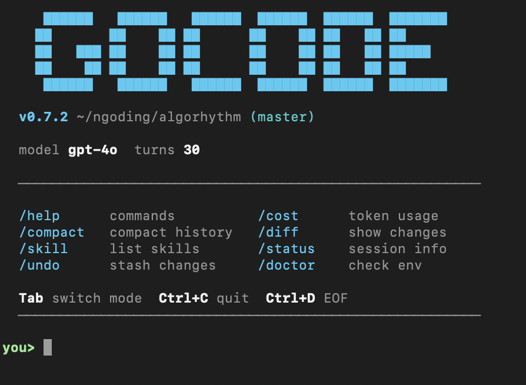

<p align="center">
  
</p>

<p align="center">
  
  
  
  
  
  
  
  
  
</p>

<h1 align="center">gocode — Claude Code, Rewritten in Go. Now Multi-Model.</h1>

<p align="center">
  
</p>

<h3 align="center">One binary. Zero dependencies. 200+ models. A team of agents.<br/>This is what an AI coding agent should feel like.</h3>

<p align="center">
  <code>go install github.com/AlleyBo55/gocode/cmd/gocode@latest</code>
</p>

---

## Why gocode Exists

Every great product starts with a simple observation.

Claude Code is a remarkable piece of engineering. But the implementation carries weight it doesn't need. And it only works with Claude.

We asked two questions: **what if the best AI coding agent was also the fastest?** And **what if it worked with any model?**

A complete, ground-up reimplementation in Go — every registry, every scoring algorithm, every subsystem — enhanced with multi-model support, multi-agent orchestration, model fallback chains, IDE-level tooling, and a skills system. One binary, any LLM, instant startup.

gocode starts in under 10 milliseconds. Ships as a single 12MB binary. Works with 200+ models across 11 providers. You download it. You run it. That's it.

---

## What's New

### v0.9.0 — One More Thing.

We thought we were done. We weren't even close.

Eighteen new capabilities. Eight new skills that make the agent think differently. A dream system that consolidates memory while you sleep. A planning engine that delegates to the strongest model in the room and comes back with a blueprint. Vim keybindings — because some of you asked, and we listened. A cron scheduler that runs tasks on your behalf when you're not looking. A swarm of agents that talk to each other. A WebSocket bridge that connects gocode to any IDE. PDF reading. Output styles. A buddy system — because even an AI agent deserves a companion.

This isn't an update. This is gocode becoming self-aware.

### v0.8.0 — Every Model. Every Provider. One Binary.

We ripped out the four-provider ceiling and replaced it with a universal model layer. 200+ models. 11 providers. Local inference. Persistent memory. Task management. Runtime hardening. The agent can search the web, delegate to specialists, and remember what you told it last week.

### v0.7.0 — The Agent Operating System

Full terminal UI. Multi-agent orchestration. Model fallback. 21 slash commands. Skills system. Plugin architecture. LSP integration. AST-grep. Everything Claude Code does, plus everything it doesn't.

### v0.3.0 — The Foundation

38 internal packages. 14 MCP tools. 5 IDEs. 4 providers. One binary. The complete Go reimplementation of Claude Code.

> **[Full Changelog →](CHANGELOG.md)**

---

## Two Modes. One Binary.

| Mode | What It Does | How You Use It |
|------|-------------|----------------|
| **Agent Mode (REPL)** | Line-based chat. Default mode. | `gocode chat` |
| **Agent Mode (TUI)** | Full terminal UI with split panels, diff viewer, themes. | `gocode chat --tui` |
| **API Server Mode** | Headless HTTP REST API for remote clients. | `gocode serve` |
| **MCP Server Mode** | Plug into Cursor, Kiro, VS Code, Antigravity, or Claude Desktop. | `gocode mcp-serve` |

---

## Supported Models

Every model. Every provider. One binary. We don't lock you in.

**4 native providers. 7 proxy services. Local inference. 200+ models.** Set one env var and go.

| Provider | Highlights | Env Var |
|----------|-----------|---------|
| **Anthropic** | Claude Opus 4.6, Sonnet 4.6, Haiku 4.5 | `ANTHROPIC_API_KEY` |
| **OpenAI** | GPT-5.4, o3, o4-mini, Codex | `OPENAI_API_KEY` |
| **Google** | Gemini 3.1 Pro, Gemini 3 Flash | `GEMINI_API_KEY` |
| **xAI** | Grok 4.20 Beta, Grok 3 | `XAI_API_KEY` |
| **DeepSeek** | DeepSeek Chat, R1 Reasoner, Coder | `DEEPSEEK_API_KEY` |
| **Mistral** | Mistral Large, Codestral, Pixtral | `MISTRAL_API_KEY` |
| **Groq** | Llama 3.3 70B at 800 tok/s | `GROQ_API_KEY` |
| **Together AI** | Llama 405B, Qwen 72B Turbo | `TOGETHER_API_KEY` |
| **OpenRouter** | 200+ models, one API key | `OPENROUTER_API_KEY` |
| **Azure OpenAI** | Enterprise GPT deployments | `AZURE_OPENAI_API_KEY` |
| **Local (Ollama/LM Studio)** | Run any model on your machine | `OPENAI_BASE_URL` |

```bash
gocode chat --model sonnet          # Claude
gocode chat --model gpt5            # GPT-5.4
gocode chat --model deepseek        # DeepSeek
gocode chat --model groq-llama      # Llama on Groq (800 tok/s)
gocode chat --model llama           # Ollama local
gocode chat --goal coding           # auto-pick the best coding model
```

### One Key. Every Model.

Don't want to manage 11 API keys? Set one OpenRouter key and access every model from every provider.

```bash
export OPENROUTER_API_KEY=sk-or-your-key

gocode chat --model openai/gpt-4o                         # GPT-4o
gocode chat --model anthropic/claude-sonnet-4-20250514    # Claude Sonnet
gocode chat --model google/gemini-2.5-pro-preview         # Gemini
gocode chat --model x-ai/grok-3                           # Grok
gocode chat --model moonshotai/kimi-k2                    # Kimi K2
gocode chat --model minimax/minimax-01                    # MiniMax
gocode chat --model qwen/qwen-2.5-72b-instruct           # Qwen
gocode chat --model deepseek/deepseek-chat                # DeepSeek
gocode chat --model meta-llama/llama-3.3-70b-instruct     # Llama
gocode chat --model mistralai/mistral-large-latest        # Mistral
```

One binary. One key. Every model on the planet. Get your key at [openrouter.ai/keys](https://openrouter.ai/keys).

> **[Full Model List — 200+ Models →](docs/supported-models.md)**

---

## Skills — Expertise on Demand

Coding agents are generalists. Skills change that. One flag, and your agent becomes a specialist.

```bash
gocode chat --skill golang-best-practices    # writes Go like a senior engineer
gocode chat --skill nothing-design           # designs like Teenage Engineering
gocode chat --skill clone-website            # reverse-engineers websites
```

### 16 Built-in Skills

| Skill | What It Does |
|-------|-------------|
| `git-master` | Atomic commits, interactive rebase, clean history |
| `frontend-ui-ux` | Design-first UI development, accessibility, semantic HTML |
| `nothing-design` | Nothing-inspired monochrome design. Swiss typography, OLED blacks. |
| `golang-best-practices` | Idiomatic Go — code style, error handling, testing, naming |
| `clone-website` | Pixel-perfect website cloning. Extract CSS, rebuild in Next.js. |
| `nextjs-best-practices` | Next.js 15+ patterns — RSC, async APIs, data fetching |
| `react-best-practices` | React performance — eliminate waterfalls, bundle size, re-renders |
| `web-design-guidelines` | Accessibility audit, responsive design, WCAG compliance |
| `loop` | Autonomous keep-going mode — works until the task is done |
| `stuck` | Recovery mode for confused or frozen agent sessions |
| `debug` | Structured troubleshooting — reproduce, isolate, fix, verify |
| `verify` | Double-check work by re-reading files, running tests, validating |
| `simplify` | Code review for complexity reduction and dead code removal |
| `remember` | Active memory management — save facts and preferences to memdir |
| `skillify` | Meta-skill — capture conversation patterns as reusable skill JSON |
| `batch` | Parallel batch processing across multiple files or worktree agents |

Create your own — drop a JSON file in `.gocode/skills/`.

### Community Skills — Standing on the Shoulders of Giants

| Skill | Inspired By | Author |
|-------|------------|--------|
| `nothing-design` | [nothing-design-skill](https://github.com/dominikmartn/nothing-design-skill) | [@dominikmartn](https://github.com/dominikmartn) |
| `golang-best-practices` | [cc-skills-golang](https://github.com/samber/cc-skills-golang) | [@samber](https://github.com/samber) |
| `clone-website` | [ai-website-cloner-template](https://github.com/JCodesMore/ai-website-cloner-template) | [@JCodesMore](https://github.com/JCodesMore) |
| `nextjs-best-practices` | [claude-code-nextjs-skills](https://github.com/laguagu/claude-code-nextjs-skills) | [@laguagu](https://github.com/laguagu) |
| `react-best-practices` | [claude-code-nextjs-skills](https://github.com/laguagu/claude-code-nextjs-skills) | [@laguagu](https://github.com/laguagu) |
| `web-design-guidelines` | [claude-code-nextjs-skills](https://github.com/laguagu/claude-code-nextjs-skills) | [@laguagu](https://github.com/laguagu) |

---

## Installation

### One-Line Install (macOS / Linux)

```bash
curl -fsSL https://raw.githubusercontent.com/AlleyBo55/gocode/main/install.sh | bash
```

### One-Line Install (Windows PowerShell)

```powershell
irm https://raw.githubusercontent.com/AlleyBo55/gocode/main/install.ps1 | iex
```

### Go Install (all platforms, requires Go 1.21+)

```bash
go install github.com/AlleyBo55/gocode/cmd/gocode@latest
```

### Download Binary Manually

Grab the binary for your platform from [GitHub Releases](https://github.com/AlleyBo55/gocode/releases):

| Platform | File |
|----------|------|
| macOS (Apple Silicon) | `gocode_*_darwin_arm64.tar.gz` |
| macOS (Intel) | `gocode_*_darwin_amd64.tar.gz` |
| Linux (x86_64) | `gocode_*_linux_amd64.tar.gz` |
| Linux (ARM64) | `gocode_*_linux_arm64.tar.gz` |
| Windows (x86_64) | `gocode_*_windows_amd64.zip` |
| Windows (ARM64) | `gocode_*_windows_arm64.zip` |

### Linux Packages (deb/rpm)

```bash
# Debian/Ubuntu
curl -fsSL https://github.com/AlleyBo55/gocode/releases/latest/download/gocode_amd64.deb -o gocode.deb
sudo dpkg -i gocode.deb

# Fedora/RHEL
curl -fsSL https://github.com/AlleyBo55/gocode/releases/latest/download/gocode_amd64.rpm -o gocode.rpm
sudo rpm -i gocode.rpm
```

### Build from Source

```bash
git clone https://github.com/AlleyBo55/gocode.git
cd gocode
go build -o gocode ./cmd/gocode/
sudo mv gocode /usr/local/bin/
```

### Verify

```bash
gocode --version
# gocode version v0.8.0
```

---

## Quickstart

```bash
# 1. Install
go install github.com/AlleyBo55/gocode/cmd/gocode@latest

# 2. Set your API key
export ANTHROPIC_API_KEY=sk-ant-...

# 3. Chat
gocode chat

# Or one-shot
gocode prompt "find all TODO comments in this project"
```

No Python. No Node. No virtual environments. One binary, one env var, go.

---

## The Numbers

| Metric | Claude Code (Node.js) | gocode (Go) |
|--------|----------------------|-------------|
| Startup time | ~200ms | **<10ms** (20× faster) |
| Binary size | ~180MB (node_modules) | **~12MB** (single file) |
| Runtime dependencies | Node.js 18+, npm | **None** |
| LLM providers | Claude only | **200+ models, 11 providers** |
| Deployment | `npm install -g` | **Copy one file** |
| Concurrency | Node.js async/await | **Goroutines + channels** |
| MCP support | Yes (client + server) | **Yes (client + server)** |
| IDE integrations | VS Code, JetBrains, Web, Desktop | **5 IDEs via MCP** |
| Multi-agent / subagents | Yes (AgentTool, TaskTools) | **Yes (4 profiles, 5 concurrent)** |
| Model fallback | No | **Yes (automatic failover)** |
| Skills system | Yes (bundled + custom) | **Yes (16 built-in + custom)** |
| Custom slash commands | Yes (markdown files) | **Yes (markdown files, YAML frontmatter)** |
| Hooks (lifecycle) | Yes (shell scripts, JSON output) | **Yes (shell scripts, JSON output, PreToolUse/PostToolUse)** |
| Web search | Yes (WebSearchTool, WebFetchTool) | **Yes (built-in, no API key)** |
| Persistent memory | Yes (memdir, team sync, aging) | **Yes (memdir, 3 scopes, aging, team sync)** |
| Git checkpoints / rewind | Yes (/rewind) | **Yes (/undo N, per-session refs)** |
| Git worktree tools | Yes (EnterWorktreeTool) | **Yes (Enter/Exit tools, /worktree commands)** |
| Voice input | Yes (/voice, STT) | Partial (/voice toggle, STT interface ready) |
| Task management tools | Yes (6 task tools) | **Yes (6 task tools, background agents)** |
| Notebook editing | Yes (NotebookEditTool) | **Yes (cell-level edit/add/remove/reorder)** |
| GitHub Actions | Yes (claude-code-action) | **Yes (gocode-action, PR review, issue impl)** |
| Structured output / SDK | Yes (Agent SDK) | **Yes (--output-format json, --output-schema)** |
| Session continue (-c) | Yes | **Yes (-c / -r flags, directory-scoped)** |
| Vim keybindings | Yes (/vim) | **Yes (/vim toggle, full normal/insert/visual modes)** |
| ULTRAPLAN deep planning | Yes | **Yes (/ultraplan, background Opus agent, 30min timeout)** |
| Dream system (memory consolidation) | Yes | **Yes (orient→gather→consolidate→prune cycle)** |
| Cron/scheduled tasks | Yes | **Yes (5-field cron, background agent execution)** |
| Bridge/IDE integration | Yes | **Yes (WebSocket server, bidirectional IDE comms)** |
| Swarm coordination | Yes | **Yes (agent-to-agent messaging, discovery registry)** |
| PDF handling | Yes | **Yes (text extraction, page separators, 50MB limit)** |
| Output styles | Yes | **Yes (concise, verbose, markdown, minimal)** |
| Migrations system | Yes | **Yes (auto-upgrade config/data on startup)** |
| Buddy system (companion) | Yes | **Yes (18 species, 5 rarities, deterministic gacha)** |
| Loop skill | Yes | **Yes (autonomous keep-going mode)** |
| Stuck skill | Yes | **Yes (structured recovery from confused state)** |
| Debug skill | Yes | **Yes (structured troubleshooting methodology)** |
| Verify skill | Yes | **Yes (double-check work against requirements)** |
| Simplify skill | Yes | **Yes (3-agent parallel code review)** |
| Remember skill | Yes | **Yes (active memory persistence across sessions)** |
| Skillify skill | Yes | **Yes (meta-skill: capture workflow as reusable skill)** |
| Batch skill | Yes | **Yes (parallel work across worktree agents)** |
| Multi-model support | No (Claude only) | **Yes (200+ models, 11 providers)** |
| Category-based routing | No | **Yes (deep/quick/visual/ultrabrain)** |
| Hash-anchored file I/O | No | **Yes (CRC32 line hashes)** |
| AST-grep integration | No | **Yes (structural code search)** |
| Tmux sessions | No | **Yes (persistent terminal sessions)** |
| TUI mode | No (Ink-based terminal UI) | **Yes (bubbletea split panels, themes)** |

---

## Documentation

| Guide | Description |
|-------|-------------|
| 📖 **[Agent Mode Guide](docs/agent-mode.md)** | Models, API keys, flags, slash commands, examples |
| 🌍 **[Supported Models](docs/supported-models.md)** | 200+ models across 11 providers |
| 🚀 **[Advanced Features](docs/advanced-features.md)** | Multi-agent, fallback, planning, skills, LSP, AST-grep |
| 🎨 **[UX Features](docs/ux-features.md)** | Streaming, thinking blocks, slash commands, cost estimation |
| 🔌 **[MCP & IDE Guide](docs/mcp-ide-guide.md)** | Cursor, Kiro, VS Code, Antigravity, Claude Desktop |
| 🏗 **[Architecture](docs/architecture.md)** | Internal packages, system diagrams, design decisions |
| 📚 **[CLI Reference](docs/cli-reference.md)** | All CLI commands with flags and examples |
| 📋 **[Changelog](CHANGELOG.md)** | Full version history |

---

## Contributing

```bash
git clone https://github.com/AlleyBo55/gocode.git
cd gocode
make test && make build
```

---

## Search Keywords

`claude code go` · `claude code golang` · `claude code alternative` · `claude code open source` · `ai coding agent go` · `go ai agent` · `mcp server go` · `cursor mcp server go` · `kiro mcp server` · `vscode mcp server golang` · `claude code go port` · `fast ai agent go` · `single binary ai agent` · `multi model ai agent` · `multi agent orchestration go` · `deepseek coding agent` · `groq fast inference agent` · `ollama coding agent` · `local llm coding agent` · `200 models ai agent` · `openai compatible agent` · `claude code replacement` · `ai pair programmer terminal`

---

## License

MIT — use it, fork it, ship it.

---

<p align="center">
  <em>"The people who are crazy enough to think they can change the world are the ones who do."</em>
</p>

<p align="center">
  <strong>gocode — the Go version of Claude Code. Now a multi-agent operating system.</strong><br/>
  One binary. Zero dependencies. Instant startup. Any LLM. A team of agents.
</p>

<p align="center">
  ⭐ Star this repo if you believe developer tools should be fast, simple, and open.
</p>
