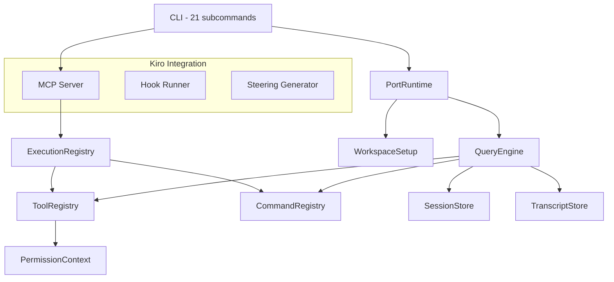

<p align="center">
  
</p>

<p align="center">
  
  
  
  
</p>

<h1 align="center">gocode</h1>

<p align="center">
  <strong>High-performance AI agent harness runtime, rewritten in Go.</strong>
</p>

<p align="center">
  A complete Go rewrite of the Claude Code agent harness runtime. Single binary, zero dependencies. Built-in MCP server, CLI tool orchestration, session management, and native Kiro integration.
</p>

<p align="center">
  <code>go install github.com/AlleyBo55/gocode/cmd/gocode@latest</code>
</p>

---

## Features

- **High-performance Go binary** - starts in <10ms, compiles to a single static binary
- **MCP server** - Model Context Protocol support over stdio and HTTP, compatible with Kiro and other MCP clients
- **AI agent tool orchestration** - route prompts to the right tools and commands with intelligent scoring
- **Session management** - persistent sessions with atomic writes, transcript tracking, history logging
- **Token budget enforcement** - turn limits, token budgets, automatic conversation compaction
- **Streaming output** - real-time results via Go channels
- **Kiro CLI integration** - hooks, steering files, spec-driven development workflows
- **Permission system** - fine-grained tool access control with deny-lists and prefix matching
- **Cross-platform** - builds for Linux, macOS, Windows (amd64 + arm64)
- **Zero runtime dependencies** - one binary, no Python, no Node, no virtualenvs

---

## The Story

Here's the thing about great software. It doesn't just work. It *disappears*. It gets out of your way and lets you do the thing you actually came to do.

Claude Code was a breakthrough. A clean-room rewrite of an agent harness runtime that showed the world how tool orchestration, session management, and prompt routing could be done right. It was beautiful. It was Python.

But we kept asking ourselves one question:

**What if it was faster?**

Not a little faster. Not "we optimized a hot loop" faster. We mean *compiled-to-native-code, single-binary, zero-dependency, starts-before-you-finish-pressing-Enter* faster.

So we rewrote the whole thing. In Go.

Not because Python is bad. Python is wonderful. But Go is something else entirely. Go is what happens when you take the best ideas in systems programming and strip away everything that doesn't matter. What you're left with is clarity. Speed. And a binary you can `scp` to any machine on earth and just *run*.

That's gocode.

---

## Why Go?

We're Go developers. We don't apologize for that. Here's why:

**One binary. Zero drama.** No virtualenvs. No pip install. No "works on my machine." You build it, you ship it, it runs. Everywhere. That's not a feature - that's a philosophy.

**Concurrency is not an afterthought.** Goroutines and channels are first-class citizens. When gocode runs prefetches, it runs them *concurrently* - not with asyncio hacks or threading workarounds, but with the language itself. The way it was meant to be.

**The compiler is your first code reviewer.** Go catches entire categories of bugs before your code ever runs. Explicit error handling means no silent failures. No "except: pass." Every error is accounted for.

**It's boring. And that's the point.** Go doesn't have 47 ways to do the same thing. It has one. The right one. That means any Go developer can read this codebase and understand it in minutes, not days.

**Speed you can feel.** gocode starts in milliseconds. Not seconds. Milliseconds. When you're in flow, every millisecond matters.

---

## What Is This?

gocode is a complete agent harness runtime - the engine that powers tool orchestration, command routing, session management, and prompt processing for AI-powered development workflows.

Think of it as the nervous system between you and your AI tools. It:

- **Routes prompts** to the right commands and tools using intelligent substring scoring
- **Manages sessions** with persistence, transcript tracking, and history logging
- **Enforces budgets** - token limits, turn limits, automatic compaction
- **Streams results** via Go channels for real-time output
- **Serves as an MCP server** - plug it into Kiro or any MCP-compatible client
- **Integrates with Kiro** - hooks, steering files, spec workflows, all native

</text>
</invoke>

---

## Architecture

```
gocode/
├── cmd/gocode/main.go          # CLI entrypoint - 21 subcommands, one binary
├── data/
│   ├── commands.json            # Embedded command registry snapshot
│   ├── tools.json               # Embedded tool registry snapshot
│   └── data.go                  # go:embed directives
├── internal/
│   ├── models/                  # Core data structs (Subsystem, PortingModule, UsageSummary)
│   ├── permissions/             # Tool access control (deny-names, deny-prefixes)
│   ├── context/                 # Workspace scanning and file discovery
│   ├── commands/                # Command registry - load, search, filter, execute
│   ├── tools/                   # Tool registry - load, search, filter by permissions/mode
│   ├── toolpool/                # Assembled tool pool with chained filters
│   ├── execution/               # Unified dispatch - MirroredCommand + MirroredTool
│   ├── queryengine/             # Core engine - turns, budgets, streaming, compaction
│   ├── session/                 # Session persistence (atomic JSON writes)
│   ├── history/                 # Session event timeline
│   ├── transcript/              # Conversation transcript management
│   ├── runtime/                 # Top-level orchestrator - routing + bootstrap
│   ├── setup/                   # Environment detection + concurrent prefetches
│   ├── deferred/                # Post-bootstrap initialization
│   ├── systeminit/              # System init message builder
│   ├── bootstrap/               # Bootstrap stage dependency graph
│   ├── commandgraph/            # Command segmentation (builtin/plugin/skill)
│   ├── manifest/                # Source directory scanner
│   ├── modes/                   # Connection modes (direct, remote, SSH, teleport)
│   ├── mcp/                     # MCP server (stdio + HTTP transports)
│   └── kiro/                    # Kiro integration (hooks, steering, specs)
├── Makefile
├── go.mod
└── go.sum
```


### How It Works



**The flow is simple:**

1. You type a command. gocode parses it with Cobra.
2. The runtime tokenizes your prompt and scores it against every registered command and tool.
3. The query engine processes the turn - tracking tokens, enforcing budgets, compacting history when needed.
4. Results stream back through Go channels. Or get persisted to disk. Or both.
5. The MCP server exposes everything over JSON-RPC - stdio for Kiro, HTTP for everything else.

---

## Quickstart

### Install

Pick your platform:

```bash
# macOS (Homebrew)
brew install AlleyBo55/gocode/gocode
```

```bash
# Linux (Debian/Ubuntu) - .deb package
curl -Lo gocode.deb https://github.com/AlleyBo55/gocode/releases/latest/download/gocode_amd64.deb
sudo dpkg -i gocode.deb
```

```bash
# Linux (Fedora/RHEL/CentOS) - .rpm package
curl -Lo gocode.rpm https://github.com/AlleyBo55/gocode/releases/latest/download/gocode_amd64.rpm
sudo rpm -i gocode.rpm
```

```bash
# Windows (Chocolatey)
choco install gocode
```

```bash
# Any OS - shell script
curl -fsSL https://raw.githubusercontent.com/AlleyBo55/gocode/master/install.sh | bash
```

```bash
# Any OS with Go 1.21+
go install github.com/AlleyBo55/gocode/cmd/gocode@latest
```

```bash
# Manual download (all platforms)
# Go to https://github.com/AlleyBo55/gocode/releases/latest
# Download the binary for your OS/arch, extract, put in your PATH
```

That's it. Type `gocode` anywhere.

### Run

```bash
# See all commands
gocode --help

# Check version
gocode --version

# List available tools
gocode tools

# List available commands
gocode commands

# Route a prompt to matching tools/commands
gocode route "read the file and run tests"

# Bootstrap a full session
gocode bootstrap "help me refactor this module"

# Run a turn loop
gocode turn-loop "search for TODO comments" --max-turns 5

# Show workspace setup report
gocode setup-report

# Show bootstrap dependency graph
gocode bootstrap-graph

# Start MCP server (for Kiro integration)
gocode mcp-serve --transport stdio
```


### Use as an MCP Server

gocode speaks MCP (Model Context Protocol) over stdio and HTTP. This means it works with any MCP-compatible client.

#### Kiro CLI

```bash
# Add gocode as an MCP server to Kiro CLI
kiro-cli mcp add \
  --name "gocode" \
  --scope global \
  --command "gocode" \
  --args "mcp-serve --transport stdio"
```

Or add it manually to `~/.kiro/settings/mcp.json`:

```json
{
  "mcpServers": {
    "gocode": {
      "command": "gocode",
      "args": ["mcp-serve", "--transport", "stdio"],
      "disabled": false
    }
  }
}
```

#### Kiro IDE

Add to your workspace `.kiro/settings/mcp.json`:

```json
{
  "mcpServers": {
    "gocode": {
      "command": "gocode",
      "args": ["mcp-serve", "--transport", "stdio"],
      "disabled": false,
      "autoApprove": ["tools/list", "commands/list"]
    }
  }
}
```

#### Cursor

Add to `.cursor/mcp.json` in your project root:

```json
{
  "mcpServers": {
    "gocode": {
      "command": "gocode",
      "args": ["mcp-serve", "--transport", "stdio"]
    }
  }
}
```

#### Claude Desktop

Add to `~/Library/Application Support/Claude/claude_desktop_config.json` (macOS) or `%APPDATA%\Claude\claude_desktop_config.json` (Windows):

```json
{
  "mcpServers": {
    "gocode": {
      "command": "gocode",
      "args": ["mcp-serve", "--transport", "stdio"]
    }
  }
}
```

#### Any MCP client (HTTP)

```bash
# Start gocode as an HTTP MCP server
gocode mcp-serve --transport http --addr :8080

# Then point your client to http://localhost:8080/mcp
```

---

## CLI Reference

| Command | Description |
|---------|-------------|
| `summary` | Render workspace summary |
| `manifest` | Print port manifest |
| `parity-audit` | Run parity audit |
| `setup-report` | Show environment and prefetch report |
| `command-graph` | Show command segmentation |
| `tool-pool` | Show assembled tool pool |
| `bootstrap-graph` | Show bootstrap stage graph |
| `subsystems` | List discovered modules |
| `commands` | List/search commands |
| `tools` | List/search/filter tools |
| `route` | Route a prompt to matching tools/commands |
| `bootstrap` | Bootstrap a full session |
| `turn-loop` | Run a stateful turn loop |
| `flush-transcript` | Flush session transcript |
| `load-session` | Restore a saved session |
| `remote-mode` | Remote runtime connection |
| `ssh-mode` | SSH-tunneled connection |
| `teleport-mode` | Teleport-based connection |
| `direct-connect` | Direct local connection |
| `deep-link` | Deep link connection |
| `mcp-serve` | Start MCP server (stdio or HTTP) |


## Key Design Decisions

| Decision | Why |
|----------|-----|
| **Cobra for CLI** | The standard. Subcommand routing, help generation, flag parsing - done right. |
| **Interfaces everywhere** | Every subsystem exposes an interface. Swap implementations. Mock in tests. Extend without breaking. |
| **`encoding/json` only** | No third-party serialization. Struct tags handle everything. Zero magic. |
| **`go:embed` for data** | Command and tool snapshots compiled into the binary. No external file dependencies. |
| **Goroutines + channels** | Streaming events, concurrent prefetches - native Go concurrency, not bolted-on async. |
| **`(T, error)` everywhere** | Every fallible operation returns an error. No panics. No silent failures. |
| **Atomic file writes** | Session persistence uses temp-file + rename. No corrupted state. Ever. |

---

## IDE and CLI Integration

gocode works with any tool that supports MCP:

| Client | Config Location | Transport |
|--------|----------------|-----------|
| **Kiro CLI** | `~/.kiro/settings/mcp.json` or `kiro-cli mcp add` | stdio |
| **Kiro IDE** | `.kiro/settings/mcp.json` | stdio |
| **Cursor** | `.cursor/mcp.json` | stdio |
| **Claude Desktop** | `claude_desktop_config.json` | stdio |
| **Any HTTP client** | `gocode mcp-serve --transport http --addr :8080` | HTTP |

Kiro-specific features:
- **Hooks** - reads hook definitions from `.kiro/hooks/`
- **Steering Files** - generates Kiro-compatible steering files from runtime state
- **Spec Workflows** - reads spec files from `.kiro/specs/`

---

## The Numbers

| Metric | Python (Claude Code) | Go (gocode) |
|--------|-------------------|-------------|
| Startup time | ~200ms | <10ms |
| Binary size | N/A (interpreted) | ~12MB (single binary) |
| Dependencies at runtime | Python 3.10+ | None |
| Deployment | pip install + venv | Copy one file |
| Concurrency model | asyncio / threading | Goroutines + channels |
| Type safety | Runtime (mypy optional) | Compile-time |

---

## Contributing

We believe the best tools are built by people who use them. If you're a Go developer who cares about agent harness engineering, developer tooling, or just writing clean code - we want you here.

```bash
# Fork, clone, hack
git clone https://github.com/YOUR_USERNAME/gocode.git
cd gocode
make test    # Run all tests
make build   # Build the binary
```

Open a PR. Start a discussion. File an issue. Every contribution makes gocode better for everyone.

---

## Credits

gocode is a complete Go rewrite of the Claude Code agent harness runtime, with added Kiro CLI integration. The original architecture demonstrated how tool orchestration, session management, and prompt routing could be done right. We took that foundation and rebuilt it in Go - faster, smaller, and ready for production.

---

<p align="center">
  <em>"The people who are crazy enough to think they can change the world are the ones who do."</em>
</p>

<p align="center">
  <strong>gocode. One binary. Infinite possibilities.</strong>
</p>

<p align="center">
  ⭐ Star this repo if you believe developer tools should be fast, simple, and beautiful.
</p>
