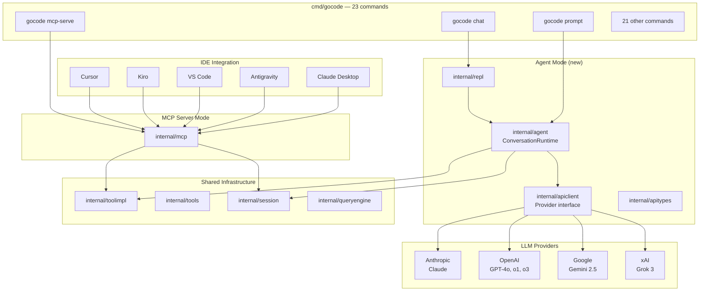

# Architecture

[← Back to README](../README.md)

gocode is built from 26 internal packages with clean interfaces and zero external runtime dependencies.

---

## Package Structure

```
gocode/
├── cmd/gocode/main.go          # CLI entrypoint — 23 subcommands
├── data/
│   ├── commands.json            # Embedded command registry (go:embed)
│   ├── tools.json               # Embedded tool definitions
│   └── data.go                  # go:embed directives
├── docs/                        # Documentation
├── internal/
│   ├── agent/                   # ConversationRuntime, ToolExecutor, permissions, hooks, usage
│   ├── apiclient/               # Provider interface, Anthropic/OpenAI/Gemini/xAI providers, SSE
│   ├── apitypes/                # Shared API types, errors, retry config
│   ├── repl/                    # Interactive REPL, streaming display, slash commands
│   ├── models/                  # Core types: ToolDefinition, InputSchema, UsageSummary
│   ├── permissions/             # Tool access control
│   ├── context/                 # Workspace scanning
│   ├── commands/                # Command registry
│   ├── tools/                   # Tool registry
│   ├── toolimpl/                # Tool implementations (BashTool, FileReadTool, etc.)
│   ├── toolpool/                # Assembled tool pool
│   ├── execution/               # Unified dispatch
│   ├── queryengine/             # Core engine — turns, budgets, compaction
│   ├── session/                 # Session persistence (atomic writes)
│   ├── history/                 # Session event timeline
│   ├── transcript/              # Conversation transcript
│   ├── runtime/                 # Top-level orchestrator
│   ├── setup/                   # Environment detection
│   ├── deferred/                # Post-bootstrap init
│   ├── systeminit/              # System init message builder
│   ├── bootstrap/               # Bootstrap stage graph
│   ├── commandgraph/            # Command segmentation
│   ├── manifest/                # Source directory scanner
│   ├── modes/                   # Connection modes
│   ├── mcp/                     # MCP server — full protocol
│   └── kiro/                    # Kiro integration
```

---

## System Overview



---

## Design Decisions

| Decision | Rationale |
|----------|-----------|
| **Go interfaces for providers** | Swap LLM backends without changing agent logic |
| **Cobra for CLI** | Industry standard. Subcommand routing, help generation, flag parsing |
| **`encoding/json` only** | No third-party serialization. Struct tags handle everything |
| **`go:embed` for data** | Tool/command registries compiled into the binary |
| **Goroutines + channels** | Native concurrency for streaming and parallel execution |
| **`(T, error)` everywhere** | Every fallible operation returns an error. No panics |
| **Atomic file writes** | Session persistence uses temp-file + rename. Zero corruption |
| **Kind-discriminated structs** | Go equivalent of Rust enums. Simple JSON serialization |

---

[← Back to README](../README.md)
